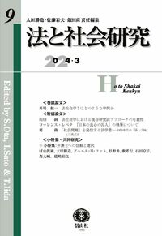
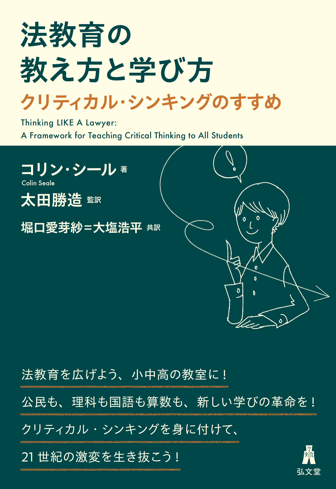
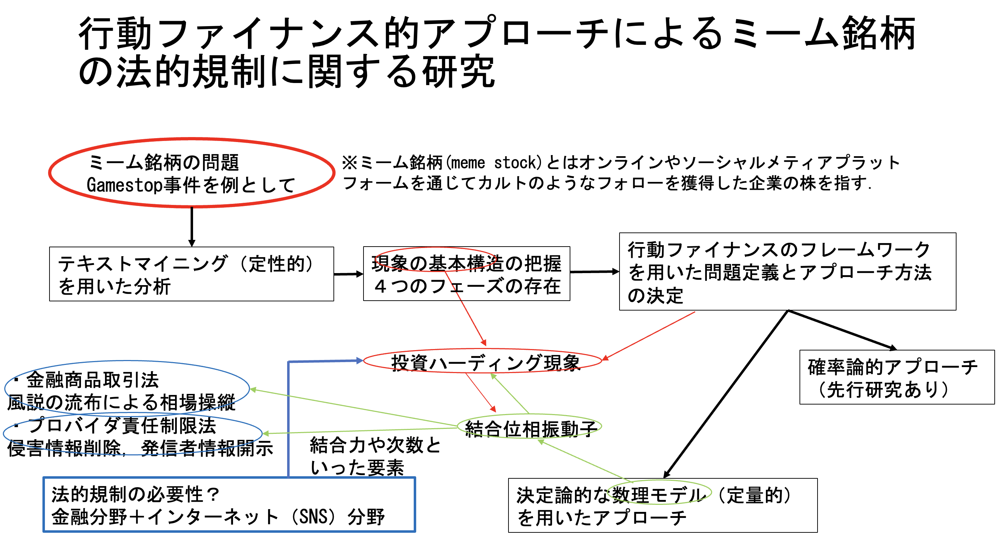

# Research-Results
研究成果をまとめていきます(2025年5月23日現在). 内定もらったので2026年から金融領域のエンジニアとして働きます. 理系学部出身で助かった. 新卒採用はマジ神. 日本語も英語も通じない場所を旅したい. 

**学歴**

[3] 2023年4月-現在 明治大学大学院 [情報コミュニケーション研究科 情報コミュニケーション学専攻](https://www.meiji.ac.jp/dai_in/infocom/index.html) 博士後期課程在籍: 石川幹人先生(認知科学, 科学基礎論, 科学技術社会論)の研究室で生成AIを用いたチャットボット開発の研究をしています.

[2] 2021年4月-2023年3月 明治大学大学院 [法学研究科 民事法学専攻 法学研究者養成コース](https://www.meiji.ac.jp/dai_in/law/outline/gaiyo.html) 博士前期課程修了 修士(法学): 太田勝造先生(法社会学, 法と経済学, 法と交渉, 法と統計学, AIと法, 民事紛争解決論)の研究室で[数理モデルを用いた法制度の創発・継受・共進化シミュレーション](https://www.meiji.ac.jp/dai_in/law/master/giving_thesis.html)について研究しました. 修士論文の内容は, 弁理士試験における「[修士・博士等の学位に基づく論文式筆記試験（選択科目）の免除](https://www.jpo.go.jp/news/benrishi/ronbun-menjo-gakui.html)」において, 理工Ⅱ(数学・物理)に該当し免除となったため理系に該当します.

[補足] 2020年4月-2020年9月 東京工業大学(現東京科学大学)大学院 情報理工学院 数理・計算科学系 数理・計算科学コース 修士課程 退学.

[1] 2016年4月-2020年3月 明治大学 [総合数理学部 現象数理学科](https://www.meiji.ac.jp/ims/subject/msbma/index.html)卒業 学士(理学): 二宮広和先生(大域解析学/非線形偏微分方程式)の研究室で[Hodgkin-Huxleyモデル](https://physoc.onlinelibrary.wiley.com/doi/epdf/10.1113/jphysiol.1952.sp004764)について研究しました.

**経歴**

[2] 2023年4月-2026年3月 明治大学経営学部[助手](https://www.meiji.ac.jp/dai_in/assistant.html)(Research Associate): 公共経営学特別講義A/B, 基礎専門特別講義B, [経営学特別講義D](https://blog.ssu.co.jp/blog/31504/?utm_source=ssug&utm_medium=email&utm_campaign=31504)の授業補助担当. その他新入生関連業務, 懸賞論文査読, 試験監督業務(大学入学共通テスト, 全学部統一入学試験, 商・経営・情コミの学部別入学試験)等.

[1] 2021年4月-2023年3月 明治大学法学部ティーチングアシスタント(TA): 法学部生の[学習サポート](https://www.meiji.ac.jp/hogaku/information/2022/mkmht0000002ksid.html)(憲法・刑法等法律基礎科目の説明業務補助, レポート作成・試験対策等), 授業補助業務, その他一般のサポート業務, 業務報告書の作成, 宣伝業務. ※コロナ期間中はzoomを用いたオンラインでの対応.

**著書・論文**

[8] 大塩浩平(2025) Meiji Opacのウェブデザイン課題と改善に向けて：ユーザビリティからの分析 明治大学図書館紀要「図書の譜」(29) 23-30頁. 査読なし.

[7] 大塩浩平(2025) [法律実務家との協働による対話促進型調停支援チャットボットの設計プロセス](pdfs/CIS2025_3C-4.pdf) 情報コミュニケーション学会第22回全国大会議事録. 発表番号3C-4. 2025年3月1日-2日. 116-119頁. 査読なし.

[6] 大塩浩平(2025) [生成AIは法的コミュニケーションを強化するか:調停離婚向けチャットボット開発に着目して](https://meiji.repo.nii.ac.jp/records/2001433) 明治大学大学院情報コミュニケーション研究論集(24) 20-40頁. 査読あり.

[5] Kohei OSHIO(2024) [Legal-Emotional BATNA: AI Chatbot Addressing Divorce Legalities and Emotional Complexities, and Research of Social Implementation in Japan](https://ebooks.iospress.nl/doi/10.3233/FAIA241264) proceedings of JURIX 2024: The Thirty-seventh Annual Conference, Brno, Czech Republic, 11-13 December 2024, pp.333-337. doi:10.3233/FAIA241264. 査読あり. 長文論文(Long papers)の採択率は23％(21件/90件), 全体(Long papers+Short papers(17件))では42％(38件/90件).

[4] ローレンス・レペタ著 太田勝造監訳 大塩浩平・堀口愛芽紗訳(2024) [『日本人の良心の囚人』の執筆について](https://www.shinzansha.co.jp/book/b10079972.html) 信山社．

[3] コリン・シール著 太田勝造監訳 堀口愛芽紗=大塩浩平共訳(2023) [法教育の教え方と学び方―クリティカル・シンキングのすすめ](https://www.koubundou.co.jp/book/b10036613.html) 弘文堂.

[2] 大塩浩平(2023) [古代東アジアにおける法制度継受現象の数理進化理論的考察 ー律令制の日本伝来に関してー](https://meiji.repo.nii.ac.jp/records/17408) 明治大学大学院法学研究論集(58) 151-172頁. 査読あり.

[1] 大塩浩平(2022) [行動ファイナンス的アプローチによるミーム銘柄の法的規制に関する研究](https://meiji.repo.nii.ac.jp/records/10780) 明治大学大学院法学研究論集(57) 79-101頁. 査読あり.

**学会発表(全て単独/口頭発表)**

[18] 大塩浩平 [法律実務家との協働による対話促進型調停支援チャットボットの設計プロセス](https://cis.gr.jp/conf/cis-22zenkoku-program.pdf) 情報コミュニケーション学会 第22回全国大会 (於: 昭和女子大学) 2025/03/02.

[17] Kohei OSHIO [Legal-Emotional BATNA: AI Chatbot Addressing Divorce Legalities and Emotional Complexities, and Research of Social Implementation in Japan](https://jurix2024.law.muni.cz/program) JURIX 2024, 37th International Conference on Legal Knowledge and Information Systems​ (in Faculty of Law, Masaryk University, Brno, Czech Republic) 2024/12/13.

[16] 大塩浩平 [スパーシャルAIと法：道路交通に関する法情報を帯びた空間におけるエージェントのシミュレーション](https://sites.google.com/hbesj.org/hbesj2024/programme) 日本人間行動進化学会 第17回大会 (於: 広島修道大学) 2024/12/07.

[15] 大塩浩平 [Legal-Emotional BATNA：AIチャットボットを用いた離婚問題における意思決定支援の試み](http://www.jlea.jp/24_zenkokutaikai_end.html) 法と経済学会　2024年（第22回）全国大会 (於: 明治大学) 2024/11/30.

[14] Kohei OSHIO [Chatbot Development for Legal Counseling Applying Design for Behavior Change and Research on Divorce Mediation Support](https://www.lawandsociety.org/wp-content/uploads/2024/06/2024-Program-Book-6th-version-6.4.pdf) Law and Society Association Annual Meeting（in Hyatt Regency Denver at Colorado Convention Center, Denver, Colorado) 2024/06/07.

[13] 大塩浩平 [日本の労働諸法による社会への介入と罰～数理モデルを用いた法と社会の共進化研究の観点から～](http://jasl.info/wp-content/uploads/2024/04/jasl2024program_0512ver.pdf) 2024年度日本法社会学会学術大会シンポジウム (於: 北海道大学) 2024/05/18.

[12] 大塩浩平 [行動変容デザインを応用した調停人サポート用チャットボット開発と離婚調停支援の研究](http://jasl.info/wp-content/uploads/2024/04/jasl2024program_0512ver.pdf) 2024年度日本法社会学会学術大会 (於: 北海道大学) 2024/05/18.

[11] 大塩浩平 調停人サポート用チャットボット Behavioral Change Mediator の開発および性能評価　四木会(交渉研究の会) (於: 明治大学) 2024/04/01.

[10] 大塩浩平 [リスク認知バイアスに基づくソフトロー・ハードローの進化経済学的分析](http://www.jlea.jp/23_zenkokutaikai_end.html) 法と経済学会　2023年（第21回）全国大会 (於: 京都大学) 2023/10/28.

[9] 大塩浩平 [リーガル・マインド養成ゲームの制作手法と調査 ―合理的なルール・メイカーを目指すDX時代の新たな法教育の土台づくりに向けて―](http://gakkai.houkyouiku.jp/pdf/JSLE20230903_ver2.1.pdf) 	法と教育学会　会員総会・第14回学術大会 (於: 立教大学) 2023/09/03.

[8] Kohei OSHIO [Law and ALife: An Interdisciplinary Approach to Law](https://portal.research.lu.se/en/activities/rcsl-law-society-and-digital-pasts-presents-and-futures-2) 2023 [RCSL(Research Committee on Sociology of Law)](pdfs/RCSL2023Lund.pdf) Meeting in Lund(Lund University, Sweden) 2023/08/31.

[7] Kohei OSHIO [Analysis of Coevolutionary Dynamics of Labor Law and Society in Japan Using a Mathematical Model of Brood Parasitism with Mafia Hypothesis](https://www.lawandsociety.org/wp-content/uploads/2023/08/2023-Program-Book.pdf) Annual Meeting on Law & Society (in Caribe Hilton, Sun Juan, Puerto Rico) 2023/06/01.

[6] 大塩浩平 [Online Dispute Resolution(ODR)における創造的な交渉支援のためのLegal-BATNA推論型AIの研究](http://jasl.info/wp-content/uploads/2023/04/2023JASL_program_v06.pdf) 2023年度 日本法社会学会学術大会 (於: 名古屋大学) 2023/05/13.

[5] Kohei OSHIO [Coevolution of Law and Society -Resilient Society and Law as an Operating System-](https://www.lawandsociety.org/lisbon-2022-homepage/) Global Meeting on Law & Society (in ISCTE University Institute of Lisbon, Lisbon, Portugal) 2022/07/13.

[4] 大塩浩平 [法とALife –数理進化理論から見た法の継受現象–](http://jasl.info/wp-content/uploads/2022/04/2022pgm220423v10.pdf) 日本法社会学会 2022年度学術大会 (於: 成蹊大学) 2022/05/21.

[3] Kohei OSHIO Coevolution of Law and Society: Resilient Society and Law as an Operating System 日本法社会学会 2022年度学術大会 (於: 成蹊大学)  若手ワークショップ([2022年法社会学国際会議リスボン大会若手研究者派遣フェローシップ受賞](pdfs/Lisbon2022.pdf)のため.) 2022/05/20.

[2] Kohei OSHIO [Network of Networks Approach to Emergence of Law](https://www.alife-japan.org/events/the-2nd-artificial-life-research-meeting) 人工生命研究会第２回ワークショップ (於: オンライン)  2021/12/06.

[1] 大塩浩平 [ミーム銘柄の影響に対する法と行動経済学的研究](http://www.jlea.jp/21zenkokutaikai_1_end.html) 法と経済学会2021年度（第19回）全国大会 (於: オンライン)  2021/11/13.

**ディスカッションペーパー(査読なし)**

[3] [法と経済学会2024](pdfs/JLEA_DP_2024_oshio.pdf) 2024/11/30.

[2] [法と経済学会2023](pdfs/JLEA_DP_2023_oshio.pdf) 2023/10/28.

[1] [法と経済学会2021](pdfs/JLEA_DP_2021_oshio.pdf) 2021/11/13.

**MISC**

[3] 2025年高知大学入学試験問題([設問三](pdfs/2025高知大学人文社会科学部小論文.pdf))で，『法教育の教え方と学び方』の69頁～84頁が使われました. 制限時間150分の小論文の課題で, 人文社会科学部の人文社会科学科と社会科学コースの入試で用いられました.

[2] 情報コミュニケーション学学際研究Ⅱにて, 国立情報学研究所情報学プリンシプル研究系 佐藤健教授による外部講師招聘講義「AIの法律分野への応用と人工知能法学の提案」コーディネーター担当. 2023/12/01.

[1] 情報コミュニケーション学学際研究Ⅱにて, [法教育の教え方と学び方―クリティカル・シンキングのすすめ](https://www.koubundou.co.jp/book/b10036613.html) を用いたオンライン書評会開催. 主催者担当. 2023/11/24.

**所属学会**

[4] 2024/11～	[情報コミュニケーション学会](https://cis.gr.jp)

[3] 2024/11～	[情報文化学会](http://jouhou-bunka.jp)

[2] 2021/08～2025/03	法と経済学会

[1] 2021/07～ [日本法社会学会](http://jasl.info/)

**メディア報道**

[7] [【情報コミュニケーション研究科】大塩浩平さんが第18回FOST賞授賞式にて第12回FOST新人賞を受賞](https://meijinow.jp/meidainews/activity-meidainews/114890) 2025/03/24. ※テーマまたは受賞理由／概要が「発表題目」となっていますが, 発表に対しての賞ではありません. 日本語が間違っているので, 正確な内容については[6]を参照してください.

[6] [【情報コミュニケーション研究科】大塩浩平さんが第12回FOST新人賞を受賞](https://www.meiji.ac.jp/dai_in/infocom/info/2024/mkmht000002bjzfd.html) 2025/03/17.

[5] [コーエーテクモINFORMATION 第18回FOST賞授賞式　公益財団法人 科学技術融合振興財団](https://www.koeitecmo.co.jp/news/docs/news_20250313.pdf) 2025/03/12.

[4] [ボードゲームの教育的な価値を戦略的に普及させてきた企業・すごろくやが社会貢献賞を受賞。「第18回FOST賞授賞式」レポート](https://www.4gamer.net/games/999/G999905/20250307031/) 2025/03/07.

[3] [【情報コミュニケーション研究科】大塩浩平さんが共訳した書籍が読売新聞に掲載](https://www.meiji.ac.jp/dai_in/infocom/info/mkmht000000txpfj.html)　2023/12/01.

[2] [2023年11月28日_読売新聞（11月26日）に太田勝造教授監訳の書籍が掲載されました！](https://www.meiji.ac.jp/hogaku/mkmht000000tz7un.html) 2023/11/28.

[1] [［記者が選ぶ］１１月２６日](https://www.yomiuri.co.jp/culture/book/columns/20231127-OYT8T50051/): 読売新聞朝刊の「本よみうり堂」のコーナーで[法教育の教え方と学び方―クリティカル・シンキングのすすめ](https://www.koubundou.co.jp/book/b10036613.html) が紹介されました. 2023/11/26.

**学術貢献活動**

[3] 2022/04〜2025/03  [「人工知能によるオンライン紛争解決(ODR)システムの構築」](https://kaken.nii.ac.jp/ja/grant/KAKENHI-PROJECT-22H00543/) JSPS基盤A 研究協力者として参加しました.

[2] 松本美由紀, 橋本龍二, 鈴木雅弘, 村山友理, 和泉潔(2024) 「[人工市場による社会ネットワーク上の情報伝播が株価に与える影響の分析](https://www.jstage.jst.go.jp/article/pjsai/JSAI2024/0/JSAI2024_2F1GS501/_pdf/-char/en)」(2024年度人工知能学会全国大会（第38回）論文集)にて, 大塩浩平(2022) [行動ファイナンス的アプローチによるミーム銘柄の法的規制に関する研究](https://meiji.repo.nii.ac.jp/records/10780)が引用されました.

[1] 東京ビッグサイトで開催された「[イノベーション・ジャパン２０１７](https://www.meiji.ac.jp/koho/meidaikouhou/201710/p05_01.html)～大学見本市＆ビジネスマッチング～」において，明治大学の大型共同研究に向けた大学組織単位による組織展示「折紙工学～新たな工法による折紙工学の新展開～」の技術員（折紙工学の説明担当）として参加しました. 2017/08/31-2017/09/01.

**インターン**

[1] 平成29年度防衛省技術系行政職夏期インターンシップ(第2期) 1週間. 2017年. 防衛施設設計演習優秀賞(第2班)受賞.

**短期留学**

[2] UC Davis Extension, English for Science and Technology Program. 2017/02/10-2017/03/10.

[1] IDEA CEBU(Cebu City, Phillippines) 2016年8月(4week).

**研究費獲得**

[3] 2024/09～2025/08  数理科学的手法を活用した調停向けチャットボットの革新的アプローチ 公益財団法人 民事紛争処理研究基金.

[2]	2023/03～2024/02  [リーガル・マインド養成ゲームの制作手法と調査 ー合理的なルール・メイカーを目指すDX時代の新たな法教育の土台づくりに向けてー](https://www.fost.or.jp/images/pdf/subsidies/FOST-2022_hojo-kekka.pdf) 公益財団法人 [科学技術融合振興財団](pdfs/FOST-2022.pdf).

[1]	2022/08～  [スパイキングニューラルネットワーク(SNN)を用いたODRにおける創造的な交渉支援研究](https://www.mhk.or.jp/dl-data/magazine_no38.pdf) 公益財団法人 [民事紛争処理研究基金](pdfs/minpun-2022.pdf).

**受賞学術賞**

[9] 公益財団法人　科学技術融合振興財団　[第12回FOST新人賞受賞](https://www.fost.or.jp/award.html). 2025/03/06.

[8] 明治大学大学院研究奨励奨学金A該当. 2023年度・2024年度.

[7] 日本法社会学会国際会議若手研究者フェローシップ受賞. 2023年度・2024年度.

[6] 明治大学大学院法学研究科 [山田準次郎奨学基金応募論文賞](https://www.meiji.ac.jp/bokin/kakusyu_1600_houken_yamadasyougakukikin.html)(対象論文: 行動ファイナンス的アプローチによるミーム銘柄の法的規制に関する研究). 2023/02.

[5] 2022年日本法社会学会国際会議リスボン大会若手研究者派遣フェローシップ受賞.

[4] 明治大学大学院博士前期課程研究科間共通科目 現象数理・ライフサイエンス融合教育系科目群 融合共創プロジェクト 共創賞(グループ3).

[3] 明治大学大学院研究奨励奨学金B（学費の1/2を受給）2021年度・2022年度(2年間継続).

[2] 明治大学総合数理学部主催TOEIC 成績優秀者. 2018年.

[1] 漢字能力検定優秀賞(個人).

**資格**

[2] 明治大学 [MaLiSEPプログラム](pdfs/2021MaLiSEP.pdf)(融合共創プロジェクトの単位修得, さらに現象数理・ライフサイエンス融合教育系科目群の3科目のうち2科目以上の単位修得, かつ大学院在籍期間中に学会発表・論文投稿・海外インターンシップや企業インターンシップなど特筆すべき活動を1件以上行った者を対象とする)修了. 2022/03/26.

[1] TOEIC845(最高スコア).

**行ったことがある国・行ってみたい国**

行ったことがある: フィリピン, アメリカ, 韓国, デンマーク, ポルトガル, プエルトリコ, スウェーデン, チェコ, オーストリア, ドイツ

お土産: ドライマンゴー(フィリピン), 韓国海苔・ゆず茶(韓国), オイルサーディン・ポートワイン・マデイラワイン・アソーレスの紅茶・ジンジーニャ・フィリグラーナ・アズレージョ・ガロ・コルク製品(ポルトガル), バカルディ・ラム, コキーグッズ, プエルトルコ産コーヒー(プエルトリコ), ダーラホース, アンナのジンジャービスケット, グスタフスベリ, Kavli BaconOst, Den Gamle Fabrik Apelsin マーマレード, 木製バターナイフ(スウェーデン), Kolonádaウエハース, チェコワイン, クルテクグッズ(チェコ)

(今のところ)行ってみたい: イタリア, ハンガリー, ルーマニア, ルクセンブルク, エストニア, ウズベキスタン, トルクメニスタン

ChatGTP「行け」: リュブリャナ(スロベニア), ペーチ(ハンガリー), ヴロツワフ(ポーランド), クルジュ＝ナポカ(ルーマニア), カウナス(リトアニア), バーリ(イタリア), ログローリョ(スペイン)

